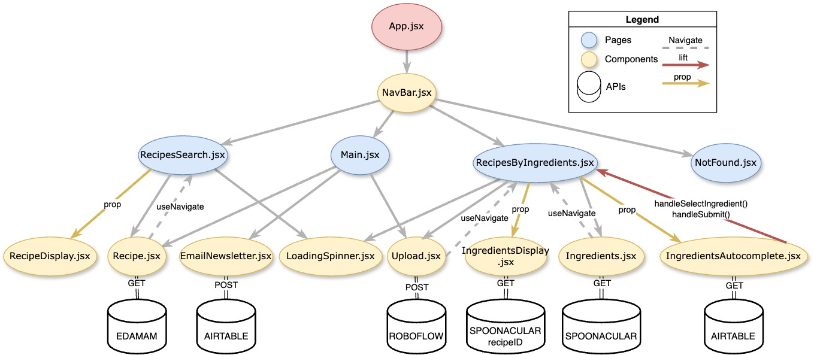

# GA Software Engineering Immersive: Project 2

Second project: Ingredient detection and Recipe Search web app built with React

# Appetity Recipe App

Appetity is like having a magical kitchen genie! You simply snap a photo of your food stash, and boom! An AI Object Detection model jumps into action, scanning your goodies like a detective on a mission. It then compiles a handy list of all the ingredients it found, saving you the hassle of manual input. But wait, there's more! With the power of autocomplete, adding or removing items from the list is as smooth as butter on a hot skillet. Now comes the exciting part - unleash the recipe hunter within you! Using the ingredients list, Appetity hunts down recipes that match your culinary inventory. It even plays matchmaker, revealing the missing ingredients you'll need for your cooking masterpiece. It's like having a personal kitchen assistant that whispers, "Psst, don't forget the garlic!" And hey, if you're not into all that fancy wizardry, no worries! Just type in your cravings, and Appetity's trusty Recipe Search will serve up delightful suggestions faster than you can say, "Bon appétit!"

## Technologies Used

## Getting Started

## Features

- This app uses 4 third party APIs to perform different actions:
  - **Object Detection Predictions** using [ROBOFLOW](https://roboflow.com/): Roboflow focus on enabling developers to easily create computer vision applications by simplifying the process of labeling data and training models. For this project I've created and trained a Object Detection Model (based on open source datasets available on their platform) so I could use it to retrieve (API) ingredient detection predictions on the photos uploaded by the user.
  - **Recipe Search by Ingredients** using [SPOONACULAR](https://spoonacular.com/food-api): For this project I used SPOONACULAR to [retrieve recipes based on a list of ingredients](https://spoonacular.com/food-api/docs#Search-Recipes-by-Ingredients) set by the user - either detected on their uploaded photo or manually added to the list - and also to [retrieve the Recipe Information](https://spoonacular.com/food-api/docs#Get-Recipe-Information) of specific recipes selected by the user.
  - **Recipe Search** using [EDAMAM](https://www.edamam.com/): For this project I used EDAMAM's [Recipe Search API](https://developer.edamam.com/edamam-docs-recipe-api) to retrieve recipes based on a search term.
  - **Extensive List of Ingredients & user email capture** using [AIRTABLE](https://airtable.com/): For this project I created an 'Ingredients List' table and populated it using a list by SPOONACULAR of the [5,000 most frequently used ingredient names](https://spoonacular.com/food-api/docs/ingredients) on their platform, used to enable a ingredients autocomplete dropdown/search input. Additionally, used another table to capture user email for newsletter sign up.
- [Bootstrap](https://getbootstrap.com/) framework was widely used in this project to ensure a reponsive and consistent web design, specially for displaying the recipes results, where the grid system and predefined CSS classes (with some tweaks of my own) played a major role.

## Architecture / Challenges

### Pages

- **Main.jsx:** Serves as the main page of the application and is responsible for rendering and arranging the components that make up the main content of the page. Inside the component, three custom components are imported and rendered: "Recipe", "Upload", and "EmailNewsletter".
- **RecipesSearch.jsx:** It represents the page where the search results for recipes are displayed. The component retrieves the recipe data from the current location using the useLocation hook from the React Router and if recipes is truthy (meaning the user landed on this page from a search in the main page), it displays the recipe search form again ("Recipe" component). It also displays the count of found recipes and iterates over the recipes array to render the individual recipe displays using the "RecipeDisplay" component. If recipes is falsy (meaning the user landed on this page from a click on the navbar), it simply displays the recipe search form ("Recipe" component).
- **RecipesByIngredients.jsx:** It represents the page where users can search for recipes based on ingredients. Inside the component, various custom components are imported, including "Upload", "IngredientsAutocomplete", "Ingredients", and "IngredientsDisplay". The component defines functions to handle ingredient selection, removal, and the submission of the ingredient list for the search query. When the form is submitted, the "ingredients" array is joined into a comma-separated string and stored in "ingredientsString". The "ingredientsString" is passed as a prop to the "Ingredients" component, which is responsible for making an API call to retrieve the recipe data based on the selected ingredients. If "recipes" exists in the location state, the returned recipe list is displayed using the "IngredientsDisplay" component (recipe details passed as props).
- **NotFound.jsx:** The page that is displayed when a user navigates to a route that does not exist. It displays an error message and an image indicating that the requested page was not found.

### Components

#### Basic web app functions:

- **App.jsx:** Overall, this component sets up the routing logic for the main, recipes, ingredients, and not found pages of the application. App is using React Router to handle routing between different pages of the application. The component also imports and includes a NavBar component.
- **NavBar.jsx:** Overall, this component creates a responsive navigation bar with links to the main, recipes, and ingredients pages of the application. The NavLink components handle the navigation logic, and the isActive class is conditionally applied to the active NavLink using a ternary operator and the styles.active class from the CSS module.
- **LoadingSpinner.jsx:** Overall, this component displays a loading spinner animation when it is rendered in the application. It imports styles from a CSS module (LoadingSpinner.module.css) to define the appearance of the loading animation.
- **EmailNewsletter.jsx:** Overall, this component provides a form for users to subscribe to an email newsletter. When the form is submitted, the user's email is sent to an Airtable API endpoint for storage and appropriate feedback is provided to the user.

#### Search Recipes by Ingredients:

- **Upload.jsx:** Overall, the Upload component provides a user interface for uploading an image, encoding it, and performing object detection on it to detect ingredients. The component includes a function convertToBase64 that converts the selected file to base64 encoding using the FileReader API. The component utilizes the useEffect hook makes an API call to a Roboflow endpoint for object detection when the fileBase64 value changes. The response from the API is processed, extracting the predicted ingredients, removing duplicates, and then navigating to "RecipesByIngredients" page with the detected ingredients as a parameter.
- **Ingredients.jsx:** This component is responsible for retrieving a list of recipes based on a list of ingredients. It uses the Spoonacular API to make a GET request and fetch the recipes. The retrieved recipes are then navigated to "RecipesByIngredients" page using the useNavigate hook from react-router-dom
- **IngredientsAutocomplete.jsx:** This component is responsible for rendering an autocomplete search feature for ingredients. It retrieves a list of ingredients from an Airtable database using the Airtable API. The component makes an initial API call to fetch the ingredients list and then recursively fetches more records if there is an offset parameter returned, as Airtable only returns 100 records per call. The retrieved data is transformed into the expected format for the dropdown options. There is also a "Find My Recipes" button that triggers a parent function on "RecipesByIngredients" when submitted.
- **IngredientsDisplay.jsx:** This component is responsible for displaying the details of a recipe's ingredients. It receives the necessary data, such as the image, title, used ingredients, and missed ingredients, as props. It renders the recipes with a button that, when clicked, triggers a function to retrieve specific recipe information using the Spoonacular API (GET). The retrieved URL of the recipe is then opened in a new tab of the browser.

#### Search Recipes:

- **Recipe.jsx:** This component represents a recipe search form that allows users to search for recipes based on their query. The component contains a form that allows users to input their recipe search query and when submitted, a function triggers Edamam Recipe Search API call (GET) with the search query. If the API call is successful, the fetched recipe data is stored, and the user is redirected to the "RecipesSearch" page, passing the recipe data as a state object. It also includes conditional rendering to display a loading spinner while the API call is being made (isLoading is true)
- **RecipeDisplay.jsx:** This component is responsible for rendering the display of a single recipe (that is called multiple times by map method in RecipesSearch page).It receives recipe data as props and displays the recipe image, source name and title as clickable links using the props.url, and rel="noopener" and target="\_blank" attributes, to open the link in a new tab.

## Some Interesting stuff...

- Learned about new hooks:
  - **useNavigate** and **useLocation** from the React Router library for managing navigation and accessing the current location in a React component.Together, these hooks enable React components to handle navigation, retrieve and utilize the current URL information, and create dynamic and interactive routing behavior, allowing state values to be passed and accessed for further processing or rendering.
  - **Select** from react-selectis is a flexible and customizable dropdown component for selecting one or multiple options from a listproviding an intuitive and user-friendly interface with features like search functionality (autocomplete), option filtering, and the ability to render custom option components.
  - **Airtable API call pagination** process of retrieving large datasets from Airtable's API in smaller chunks or pages (max return per call is 100 records), using pagination parameters like "offset" or "page size," to handle and iterate through the data.

## Next Steps

Implement:

- User login functionality
- Ability to save favorite recipes in a searcheable 'Recipes Book' page
- ability to 'Sort by' on recipe results
- Toggle on/off show Ingredients list on recipe results
- Ability to exclude certain ingredients defined by user from search results
